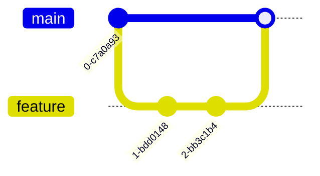
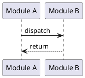

# hey

## Mermaid 

Mermaid GitGraph example


```mermaid
gitGraph
    checkout main
    commit
    branch feature
    checkout feature
    commit
    commit
    checkout main
    merge feature
```

## PlantUML

Simple sequence diagram example


```plantuml
@startuml simple-sequence-diagram
participant "Module A" as A
participant "Module B" as B
A -> B: dispatch
B --> A: return
@enduml
```

## D2

```d2
direction: right
box1 -> box2
box1 -> box3
```